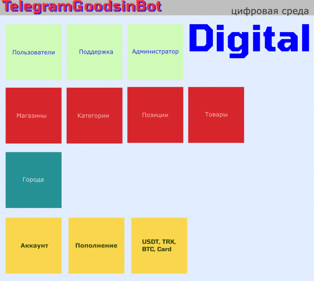
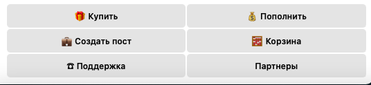
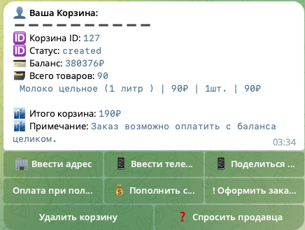

A store with the functionality of multi-cities, multi-merchants. Бот - магазин в Телеграм с гибким каталогом, спраочник городов и управление продажами и продавцами.

<h1 align="center">Цифровая среда в Телеграм <a href="https://aliplaces.ru/" target="_blank">GoodsinBot</a></h1>

<h2>Digital</h2>

<ul>
    <li> пополнение баланса с банковских карт с подтверждением Администратором</li>
</ul>

<h2>
Автошоп цифровых товаров
</h2>
Мы рады Вам представить готовый магазин цифровых товаров в Телеграм. Полный цикл - от хранения Ваших цифровых товаров, показа их в каталоге до оплаты и выдачи покупателю.

<h2>Модули</h2>
<ul>
<li> управление локацией пользователя, хранение города пользователя</li>
<li> управление языками интерфейса(Русский, Английский)</li>
<li> управление товарами и категориями товаров</li>
<li> управление магазинами</li>
<li> управление местами отдыха, артистами, событиями</li>
<li> управление кружками, местами обучения</li>
<li> управление частными объявлениями</li>
<li> управление балансами пользователей</li>
<li> управление заказами и доставкой товаров</li>
<li> управление рассылками сообщений, постов</li>
</ul>

<h3>Подсистема рассылок и публикаций постов, новостей и анонсов позиций</h3>
<ul>
    <li>создание постов, новостей и анонсов</li>
    <li>создание списков каналов для публикации и групп для рассылки</li>
    <li>рассылка по расписанию</li>
</ul>

<h3>Интеграция с МойСклад</h3>
<ul>
<li> получение товаров по складам</li>
<li> получение остатков по складам</li>
<li> получение цен</li>
<li> создание заказа покупателя</li>
</ul>

<h3>Функции для пользователя</h3>

<b> Купить | Пополнить | Создать пост | Корзина | Поддержка | Партнера </b>
<ul>
<li> каталог двух уровней, категория - товар</li>

<li> корзина</li>
<li> поддержка (контакты) - ссылка в диалог с администратором</li>
<li> FAQ - сообщение для пользователей с HTML разметкой</li>
<li> подробная Статистика бота: кол-во пополнений, покупок, пользователей, позиций, категорий, чистой прибыли</li>
<li> определение местонахождения пользователя</li>
<li> пополнение счет в рублях через ЮМани, USDT TRC20, BTC BEP20, Карточные платежи</li>
</ul>

<h3>Функции администратора</h3>
<ul>
<li> режим технических работ</li>
<li> проверка наличия обнолвения при запуске</li>
<li> активация/деактивация функций продажи и оплаты</li>
<li> добавление неограниченного количества глобальных администраторов</li>
<li> роль администратора магазина, управляющего своими товарами в каталоге</li>
<li> добавление неограниченного количества администраторов магазинов</li>
<li> удобная и многофункциональная админ панель</li>
<li> определение и хранение города нахождения товара</li>
<li> поиск покупателей и просмотр профилей</li>
<li> рассылка сообщений всем пользователям ботаизменение и пополнение баланса пользователя</li>
<li> рассылка сообщений всем пользователям ботаотчет о продажах продавцов</li>
</ul>

<h3>Оплата товаров</h3>
<ul>
<li> используется библиотеки YooMoney, Crypto платежи</li>
<li> настраивается администратором бота через админку</li>
<li> проверка работоспособности из админки</li>
<li> вывод баланса кошелька в любой из валют</li>
</ul>

<h3>Каталог и товары</h3>
<ul>
<li> User-friendly каталог</li>
<li> товары имеют одно изображение</li>
<li> гибкое управление товарами администраторами</li>
<li> выгрузка всех товаров</li>
</ul>

<h3>Защита</h3>
<ul>
<li> админ-фильтры на все хендлеры, гарантирующие приватность админ функционала</li>
<li> защита от оплаты в тенге при пополнении баланса</li>
<li> защита от неправильного HTML синтаксиса</li>
<li> защита от повторной выдачи баланса</li>
<li> защита от спама в боте (Middlewares)</li>
</ul>

<h3>Перед установкой</h3>
<h4>install Python3.10</h4>
<code>apt update && sudo apt upgrade
wget https://www.python.org/ftp/python/3.10.0/Python-3.10.0rc2.tgz
tar -xf Python-3.10.*.tgz
cd Python-3.10.0rc2
./configure --enable-optimizations
make -j 4
sudo make altinstall</code>

<h3>#check install & config</h3>
<code>python3.10 --version
update-alternatives --list python3
update-alternatives --install /usr/bin/python3 python3 /usr/local/bin/python3.10 1</code>

<h3>настройки settings.ini</h3>
<ul>
<li> установить токен Бота, полученный у @BotFather</li>
<li> установить Telegram ID администратора</li>
<li> стартовать бот - администоратору, бот создаст строку в БД</li>
<li> установить в БД [database.db] в таблице storage_users значение в поле user_role = "Admin" в строке администратора</li>
</ul>

<h3>Настройка</h3>
<ul>
<li>1. Требуемая версия Python 3.9, рекомендуемая Python 3.10.</li>
<li>2. Скопируйте папку бота. Перейдите в папку бота.</li>
<li>3. Выполните в командной строке "pip install -r requirements.txt".</li>
<li>4. Заполните файл settings.ini.</li>
<li>5. Стартовать бот в командной строке: python3 main.py.</li>
<li>6. Изменить роль первого пользователя на 'Admin'.</li>
<li>7. Заполнить информационные поля(FAQ, поддержка).</li>
<li>8. Наполнить каталог товарами.</li>
<li>9. Добавить реквизиты для оплаты товаров.</li>
</ul>

<h3>Процесс администрирования площадки</h3>
<ul>
<li> согласование продавцов.</li>
<li> администрирование каталога.</li>
<li> администрирование денежных средств.</li>
<li> поддержка и ведение сделок, разрешение споров.</li>
</ul>

<h3>Процесс покупки для покупателя</h3>
<ul>
<li>1. Выбор товара.</li>
<li>2. Пополнение счета.</li>
<li>3. Ожидание звонка продавца и уточнение параметров домтааки.</li>
<li>4. Получение товара.</li>
<li>5. Подтверждение получения.</li>
<li>6. Отправка отзыва о продавце.</li>
</ul>

<h3>Процесс продажи для продавца</h3>
<ul>
<li>1. Получение сообщения о заказе.</li>
<li>2. Звонок покупателю.</li>
<li>3. Отправка товара покупателю.</li>
<li>4. Получение отзыва о покупателе.</li>
</li>

<!-- TODO:
<ul>
<li>- расчет доставки сборного заказа</li>
<li>- поиск в каталоге</li> -->
</ul>

<code>
Работающий экземпляр уже в 192 городах России: https://t.me/Goodsin2bot
Чтобы торговать своими товарами, отправьте запрос на продавца из бота, нажав "Я продавец" или напишите мне, чтобы развернуть Вам полностью всего бота или его часть(платная опция).</code>

<h3>**Преимущества нашего бота**</h3>
Существует множество преимуществ для торговли цифровыми товарами через Интернет, но вот некоторые из наиболее значимых:

1. Возможность покупки и продажи в любое время и в любом месте, где есть доступ к Интернету.
2. Быстрое и удобное совершение покупок онлайн.
3. Большой выбор цифровых товаров высокого качества.
4. Низкие цены за счет отсутствия посредников.
5. Удобная система оплаты и доставки.
6. Продвинутые функции маркетинга и аналитики для эффективного продвижения вашего бизнеса в Интернете.
7. Высокая степень конфиденциальности и защиты персональных данных покупателей.
8. Возможность работы с клиентами 24/7, без необходимости посещения физического магазина.
9. Возможность отслеживания статуса заказа и получения уведомлений об изменениях.
10. Широкая аудитория пользователей, которая может быть настроена на вашу целевую аудиторию.

    
<h3>Telegram Ra</h3>
<h4>Telegram Ra функционал</h4>
- добавление аккаунтов Телеграм
- учет исключений и ограничений платформы
- парсинг групп Телеграм
- ведение базы собранных аккаунтов
- инвайт собранной аудитории в целевую группу
- ведение прогресса инвайта собранной аудитории
- плавная безостановочная работа
- управление параметрами привлечения
- интерфейс из терминала, возможность запустить процесс как на ПК, так и на сервере или удаленно

по вопросам пишите в ТГ: @raclear

<h4>How and where to change code:</h4>
- **to add your city** - table data_cities [database.db], each city have coordinates of his center.

<h2>THE ACTUAL VERSION OF BOT IS AVAIBLE ON REQUEST | 
АКТУАЛЬНАЯ ВЕРСИЯ БОТА ДОСТУПНА ПО ЗАПРОСУ</h2>

