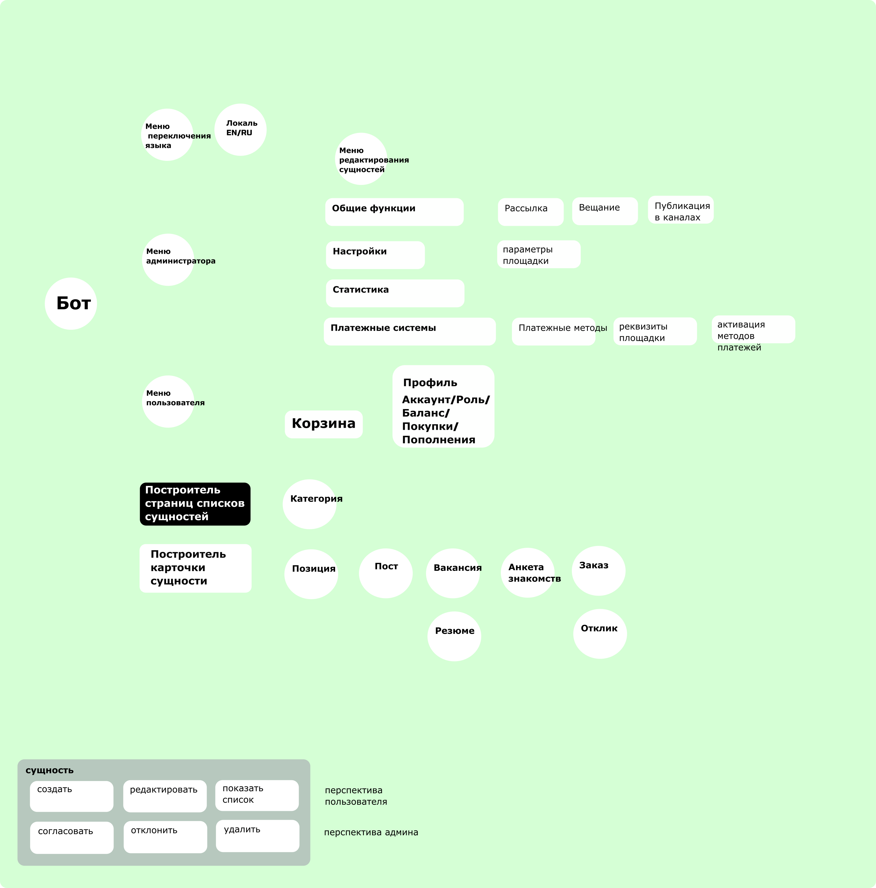
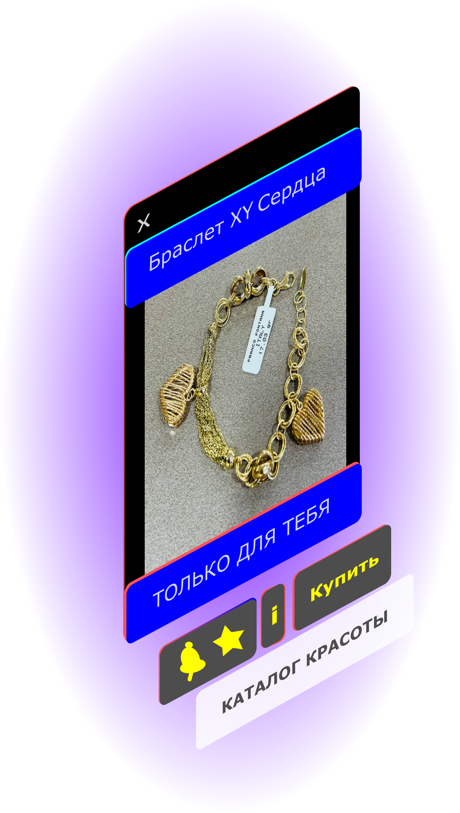
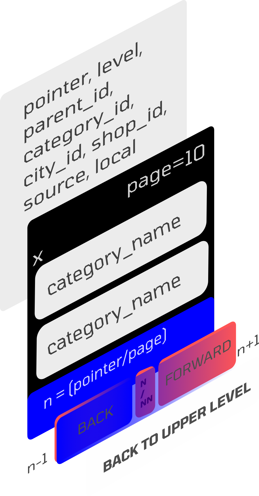
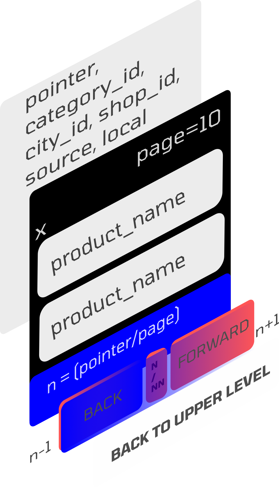

# TelegramGoodsInbot
Бот на Python, магазин с каталогом и автопродажей товаров, методы пополнения: карты, USDT, TRX, BTC, LTC, ETH. Реализован i18n: Английский и Русский.

A store with the functionality of multi-cities. 
Магазин в Телеграм: каталог, оплата YooMoney, корзина, мульти-города и мульти-продавцы, рассылки, поддержка мультиязычности и многое другое.

##Модули
- управление локацией пользователя, хранение города пользователя
- управление языками интерфейса
- управление товарами и категориями товаров
- управление магазинами
- управление местами отдыха, артистами, событиями
- управление кружками, местами обучения
- управление частными объявлениями
- управление балансами пользователей
- управление заказами и доставкой товаров
- управление рассылками сообщений

##Функции для пользователя
- каталог двух уровней, категория - товар
корзина
- поддержка (контакты) - ссылка в диалог с администратором
- FAQ - сообщение для пользователей с HTML разметкой
- подробная Статистика бота: кол-во пополнений, покупок, пользователей, позиций, категорий, чистой прибыли
- определение местонахождения пользователя

##Функции администратора
- режим технических работ
- проверка наличия обнолвения при запуске
- активация/деактивация функций продажи и оплаты
- добавление неограниченного количества глобальных администраторов
- роль администратора магазина, управляющего своими товарами в каталоге
- добавление неограниченного количества администраторов магазинов
- удобная и многофункциональная админ панель
- определение и хранение города нахождения товара
- поиск покупателей и просмотр профилей
- поиск чеков покупок
- рассылка сообщений всем пользователям бота
- изменение и пополнение баланса пользователя
- отчет о продажах продавцов

##Оплата товаров
- используется библиотеки QIWI и YooMoney
- настраивается администратором бота через админку
- проверка работоспособности из админки
- вывод баланса кошелька QIWI

##Каталог и товары
- User-friendly каталог
- товары имеют одно изображение
- гибкое управление товарами администраторами
- выгрузка всех товаров

##Защита
- админ-фильтры на все хендлеры, гарантирующие приватность админ функционала
- защита от оплаты в тенге при пополнении баланса
- защита от неправильного HTML синтаксиса
- защита от повторной выдачи баланса
- защита от спама в боте (Middlewares)

##настройки settings.ini
- установить токен Бота, полученный у @BotFather
- установить Telegram ID администратора

##Настройка
- Скопируйте папку бота. Перейдите в папку бота.
- Выполните в командной строке "pip install -r requirements.txt".
- Заполните файл settings.ini.
- Стартовать бот в командной строке: python3 main.py.
- Заполнить информационные поля.
- Наполнить каталог товарами.
- Привлекать пользователей в каталог.

##Процесс администрирования площадки
- Согласование продавцов.
- Администрирование каталога.
- Администрирование денежных средств.
- Поддержка и ведение сделок, разрешение споров.

##Процесс покупки для покупателя
- Выбор товара.
- Пополнение счета.
- Ожидание звонка продавца и уточнение параметров домтааки.
- Получение товара.
- Подтверждение получения.
- Отправка отзыва о покупателей.

#Процесс продажи для продавца
- Получение сообщения о заказе.
- Звонок покупателю.
- Отправка товара покупателю.
- Получение отзыва о покупателей.

###TODO:
- web-витрина товаров

##Обновления:
25 сентября 2023: Исправления и улучшения
- добавлен переключатель количества в карточке позиции
- добавлена опция включения/отключения deep link в карточке позиции
- добавлена опция включение/отключения рейтингов позиций
- добавлены логотипы в каталоге для категорий
- добавлен метод платежей LTC
- перенесена конфигурация в YAML формат и проверяется в момент старта бота.
- роли админа из файла конфигурации автоматически обновляются пользователям, которые есть в БД бота.

##DeepLink - возможность делиться со всем Интернет
- бот автоматически создает ссылку на Ваш товар
- при вводе в браузер бот автоматически открывает карточку товарв.

##Модель Бота
Модель отражает основные объекты и их отношения, как объектов и их представления.

##СХЕМА КАРТОЧКА ПРОДУКТА - ПРИМЕР

##СХЕМА ПАГИНАТОРА

Работающий экземпляр пока только по России в 192 городах: https://t.me/Goodsin2bot
Наш сайт: https://aliplaces.ru
По вопросам пишите пожалуйста в телеграм: @raclear
